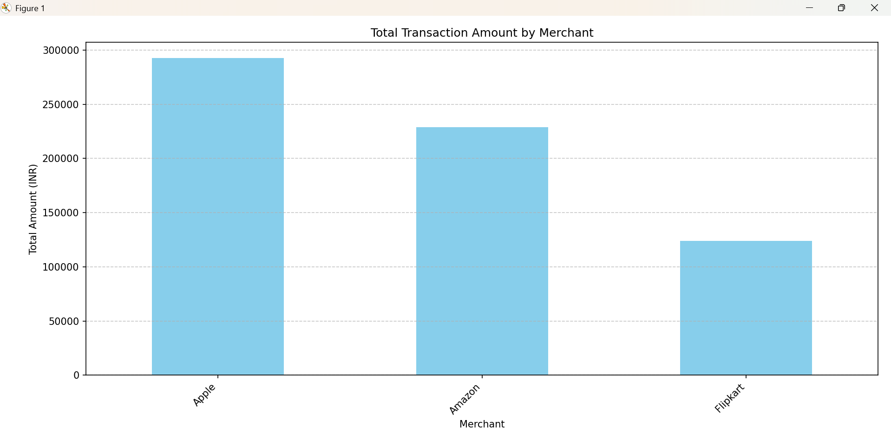

# Financial ETL Pipeline with Airflow

A complete ETL pipeline built using **Apache Airflow**, **PostgreSQL**, and **Python** to ingest, transform, store, and visualize financial transactions. The project includes monthly aggregation logic and a final bar chart summary.

---

## Features

- CSV ingestion from raw transaction data
- Transformation logic to clean and format data
- Postgres integration with table creation and loading
- Monthly summary aggregation (total, average, count)
- Bar chart visualization of transaction summaries
- Fully automated with Airflow DAG and Python tasks

---

## Final Output

---

## Folder Structure
airflow-finance/
├── dags/
│ └── financial_etl_dag.py
├── exported_data/
│ └── monthly_summary.csv
├── visualize/
│ ├── visualize_summary.py
│ └── bar_chart.png
├── docker-compose.yaml
├── requirements.txt
└── README.md

##  Tech Stack

- Python 3.10
- Apache Airflow 2.9
- PostgreSQL
- Docker Compose
- Pandas & Matplotlib

##  Why This Project Matters

> In the financial sector, timely and accurate transaction summaries are critical for reporting, fraud detection, and decision-making. This project simulates a real-world data pipeline for handling and summarizing transactional data, showcasing business logic and operational automation with Airflow.

